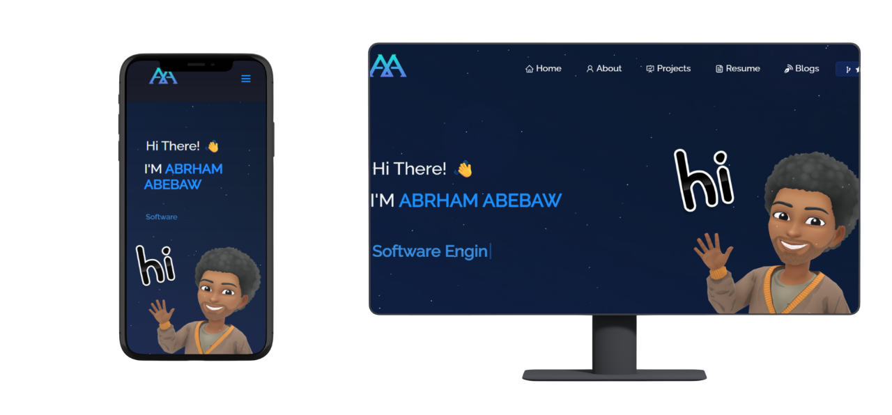

<h2 align="center">
  My Portfolio Website <br/>
  <a href="https://your-portfolio-link.com" target="_blank">Abrham.dev</a>
</h2>

<div align="center">
  
</div>

<br/>

<center>

[](https://forthebadge.com) &nbsp;
[](https://forthebadge.com) &nbsp;
[](https://forthebadge.com) &nbsp;
 &nbsp;


</center>

<h3 align="center">
    🔹
    <a href="https://github.com/abrhamabebaw/portfolio/issues">Report Bug</a> &nbsp; &nbsp;
    🔹
    <a href="https://github.com/abrhamabebaw/portfolio/issues">Request Feature</a>
</h3>

---

## TL;DR

You can fork this repo and customize it for your own portfolio. If you do, please consider giving credit by linking back to [Abrham Abebaw](https://github.com/abrhamabebaw). Thanks!

---

## Built With

This is my personal portfolio <a href="https://your-portfolio-link.com" target="_blank">Abrham.dev</a>, featuring some of my projects, resume, and technical skills.<br/>

This project was built using:

- React.js  
- Django (for backend projects)  
- CSS3  
- VS Code  
- Vercel (for deployment)  

---

## Features

**📖 Multi-Page Layout**  
**🎨 Styled with React and CSS, easy to customize**  
**📱 Fully Responsive**  

---

## Getting Started

Clone this repository. You will need `node.js` and `git` installed globally.

---

## 🛠 Installation and Setup Instructions

1. Install dependencies:  
   ```bash
   npm install
